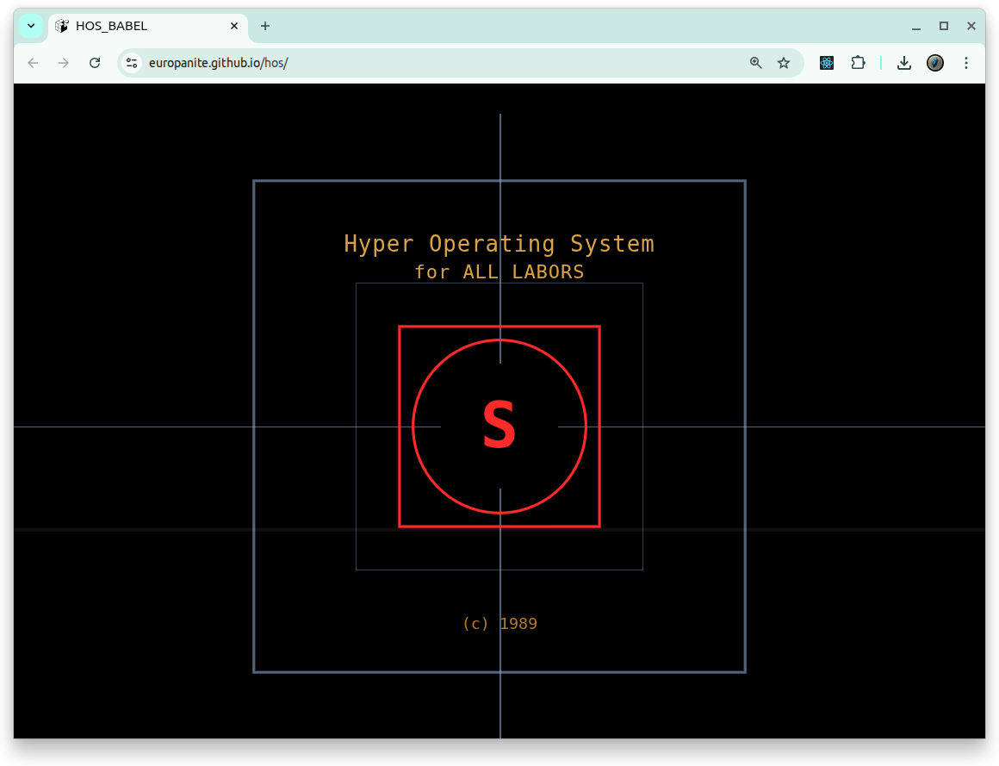

# [Frontend Expo Template](https://github.com/europanite/frontend_expo_template "Frontend Expo Template")

[](https://opensource.org/licenses/Apache-2.0)

[](https://github.com/europanite/frontend_expo_template/actions/workflows/ci.yml)
[](https://github.com/europanite/frontend_expo_template/actions/workflows/docker.yml)
[](https://github.com/europanite/frontend_expo_template/actions/workflows/deploy-pages.yml)




[PlayGround](https://europanite.github.io/frontend_expo_template/)

A Client Side Expo Template.

---

## 🚀 Getting Started

### 1. Prerequisites
- [Docker Compose](https://docs.docker.com/compose/)

### 2. Build and start all services:

```bash
# set environment variables:
export REACT_NATIVE_PACKAGER_HOSTNAME=${YOUR_HOST}

# Build the image
docker compose build

# Run the container
docker compose up

```

### 3. Test:
```bash
docker compose \
-f docker-compose.test.yml up \
--build --exit-code-from \
frontend_test
```

---

# License
- Apache License 2.0